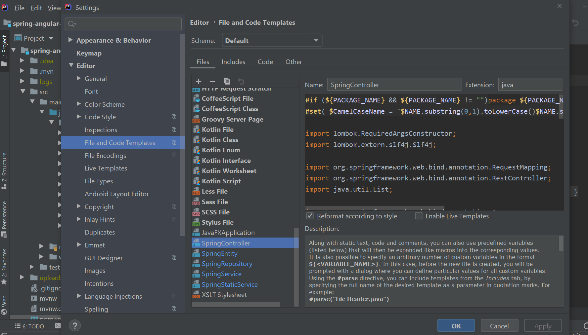

For devlopment I am using Intellij IDE. I found "File and Code Templates" and "Live Templates" very useful, It is really helpful while doing day to day devlopment. It save some time and be more productive.

Mostly we work on Rest APIs. So I created following File Templates

1. Spring Controller
2. Spring Entity
3. Spring Repository
4. Spring Service
5. Spring Static Service

Go to file-> setting and search for "File Templates".

## Spring Controller
* On Files tab click on + (Create Template)
* Enter Name as : "SpringController", and leave Extension as java
* In the Content text box add the following content

<pre>
#if (${PACKAGE_NAME} && ${PACKAGE_NAME} != "")package ${PACKAGE_NAME};#end
#set( $CamelCaseName = "$NAME.substring(0,1).toLowerCase()$NAME.substring(1)" )

import lombok.RequiredArgsConstructor;
import lombok.extern.slf4j.Slf4j;

import org.springframework.web.bind.annotation.RequestMapping;
import org.springframework.web.bind.annotation.RestController;
import java.util.List;

import org.springframework.web.bind.annotation.*;

@CrossOrigin
@RestController
@RequestMapping("/api")
@RequiredArgsConstructor
@Slf4j
public class ${NAME}Controller {
	
	@GetMapping("/${CamelCaseName}s")
	public List<${NAME}> getAll${NAME}s() {
		return ${NAME}Service.getAll${NAME}s();
	}
	
	@GetMapping("/${CamelCaseName}/{${CamelCaseName}Id}")
	public ${NAME} get${NAME}Details(@PathVariable Long ${CamelCaseName}Id) {
		return ${NAME}Service.get${NAME}Details(${CamelCaseName}Id);
	}

	@PostMapping("/add${NAME}")
	public ${NAME} add${NAME}(@RequestBody ${NAME} ${CamelCaseName}) {
		return ${NAME}Service.add${NAME}(${CamelCaseName});
	}
	
	@PutMapping("/update${NAME}/{${CamelCaseName}Id}")
	public ${NAME} update${NAME}(@PathVariable Long ${CamelCaseName}Id, @RequestBody ${NAME} ${CamelCaseName}) {
		return ${NAME}Service.update${NAME}(${CamelCaseName}Id, ${CamelCaseName});
	}
	
	@DeleteMapping("/delete${NAME}/{${CamelCaseName}Id}")
	public ${NAME} delete${NAME}(@PathVariable Long ${CamelCaseName}Id) {

		return ${NAME}Service.delete${NAME}(${CamelCaseName}Id);
	}
}
</pre>
* Click Ok Button

 ## Spring Entity
* On Files tab click on + (Create Template)
* Enter Name as : "SpringController", and leave Extension as java
* In the Content text box add the following content
<pre>
#if (${PACKAGE_NAME} && ${PACKAGE_NAME} != "")package ${PACKAGE_NAME};#end

import lombok.Getter;
import lombok.Setter;
import lombok.AllArgsConstructor;
import lombok.Data;
import lombok.NoArgsConstructor;

import javax.persistence.Entity;
import javax.persistence.GeneratedValue;
import javax.persistence.GenerationType;
import javax.persistence.Id;
import javax.persistence.Table;

@Setter
@Getter
@NoArgsConstructor
@AllArgsConstructor
@Entity
@Table(name = "${NAME}")
public class ${NAME} {
    @Id
    @GeneratedValue(strategy = GenerationType.IDENTITY)
    private Long id;
    private String name;
	
	public ${NAME}() {}
	
	public ${NAME}(Long id, String name) {		
		this.id = id;
		this.name = name;		
	}

}
</pre>

* Click Ok Button

 ## Spring Repository
* On Files tab click on + (Create Template)
* Enter Name as : "SpringController", and leave Extension as java
* In the Content text box add the following content
<pre>
#if (${PACKAGE_NAME} && ${PACKAGE_NAME} != "")package ${PACKAGE_NAME};#end
#set ($index = $NAME.indexOf('Repository'))
#set ($ENTITY= $NAME.substring(0, $index))

import org.springframework.data.jpa.repository.JpaRepository;

public interface ${NAME} extends JpaRepository<$ENTITY, Long> {
}
</pre>

* Click Ok Button

 ## Spring Service
* On Files tab click on + (Create Template)
* Enter Name as : "SpringController", and leave Extension as java
* In the Content text box add the following content
<pre>
#if (${PACKAGE_NAME} && ${PACKAGE_NAME} != "")package ${PACKAGE_NAME};#end
#set( $CamelCaseName = "$NAME.substring(0,1).toLowerCase()$NAME.substring(1)" )

import lombok.RequiredArgsConstructor;
import lombok.extern.slf4j.Slf4j;
import java.util.List;
import java.util.Optional;

import javax.management.RuntimeErrorException;

import org.springframework.transaction.annotation.Transactional;
import org.springframework.beans.factory.annotation.Autowired;
import org.springframework.data.domain.Page;
import org.springframework.data.domain.PageRequest;
import org.springframework.data.domain.Pageable;
import org.springframework.data.domain.Sort;

import org.springframework.stereotype.Service;
import ${PACKAGE_NAME}.repositories.${NAME}Repository;

@Service
@Transactional
@RequiredArgsConstructor
public class ${Name}Service{

	@Autowired
	private ${Name}Repository ${CamelCaseName}Repository;
	
	
	public List<${Name}> getAll${Name}s() {
		return ${CamelCaseName}Repository.findAll();
	}

	
	public void save${Name}(${Name} ${CamelCaseName}) {		
		this.${CamelCaseName}Repository.save(${CamelCaseName});
		
	}

	
	public ${Name} get${Name}ById(long id) {
		Optional<${Name}> optional = ${CamelCaseName}Repository.findById(id);
		${Name} ${CamelCaseName} = null;
		if(optional.isPresent()) {
			${CamelCaseName} = optional.get();
		} else {
			throw new RuntimeException("${CamelCaseName} not found for id:"+id);
		}
		return ${CamelCaseName};
			
	}

	
	public void delete${Name}ById(long id) {
		this.${CamelCaseName}Repository.deleteById(id);		
	}

	
	public Page<${Name}> findPaginated(int pageNo, int pageSize, String sortField, String sortDirection) {
		Sort sort = sortDirection.equalsIgnoreCase(Sort.Direction.ASC.name()) ? Sort.by(sortField).ascending() :
			Sort.by(sortField).descending();
		
		Pageable pageable = PageRequest.of(pageNo -1,pageSize);
		return this.${CamelCaseName}Repository.findAll(pageable);

	}
	
	public static ${NAME} update${NAME}(Long ${CamelCaseName}Id, ${NAME} ${CamelCaseName}) {
	
		${NAME} ${CamelCaseName} = ${CamelCaseName}Repository.findById(${CamelCaseName}Id)
                .orElseThrow(() -> new ResourceNotFoundException("${NAME} not found for this id :: " + ${CamelCaseName}Id));
	
		${CamelCaseName}.setId(${CamelCaseName}Id);
		this.${CamelCaseName}Repository.save(${CamelCaseName})
		return ${CamelCaseName};
	}
	

}
</pre>

* Click Ok Button

 ## Spring Static Service
* On Files tab click on + (Create Template)
* Enter Name as : "SpringController", and leave Extension as java
* In the Content text box add the following content
<pre>
#if (${PACKAGE_NAME} && ${PACKAGE_NAME} != "")package ${PACKAGE_NAME};#end
#set( $CamelCaseName = "$NAME.substring(0,1).toLowerCase()$NAME.substring(1)" )

import lombok.RequiredArgsConstructor;
import lombok.extern.slf4j.Slf4j;

import org.springframework.stereotype.Service;
import org.springframework.transaction.annotation.Transactional;

import ${PACKAGE_NAME}.repositories.${NAME}Repository;

@Service
@Transactional
@RequiredArgsConstructor
@Slf4j
public class ${NAME}Service {
    private final ${NAME}Repository ${CamelCaseName}Repository;
	
	
	private static Map<Long, ${NAME}> ${CamelCaseName}s =  new HashMap<>();
	
	private static Long index=2L;
	
	static {
			${NAME} ${CamelCaseName}01 = new ${NAME}(1L, "${CamelCaseName}1");
			${NAME} ${CamelCaseName}02 = new ${NAME}(2L, "${CamelCaseName}2");
			${CamelCaseName}s.put(1L,${CamelCaseName}01);
			${CamelCaseName}s.put(2L,${CamelCaseName}02);
	};
	
	public static List<${NAME}> getAll${NAME}s() {
		return new ArrayList<>(${CamelCaseName}s.values());
	}
	
	public static ${NAME} get${NAME}Details(Long ${CamelCaseName}Id) {
		return ${CamelCaseName}s.get(${CamelCaseName}Id);
	}
	
	public static ${NAME} add${NAME}(${NAME} ${CamelCaseName}) {
		index +=1;
		${CamelCaseName}.setId(index);
		${CamelCaseName}s.put(index, ${CamelCaseName});
		return ${CamelCaseName};
	}
	
	public static ${NAME} update${NAME}(Long ${CamelCaseName}Id, ${NAME} ${CamelCaseName}) {
		${CamelCaseName}.setId(${CamelCaseName}Id);
		${CamelCaseName}s.put(${CamelCaseName}Id, ${CamelCaseName});
		return ${CamelCaseName};
	}
	
	public static ${NAME} delete${NAME}(Long ${CamelCaseName}Id) {
		return ${CamelCaseName}s.remove(${CamelCaseName}Id);
	}
    
}
</pre>

* Click Ok Button